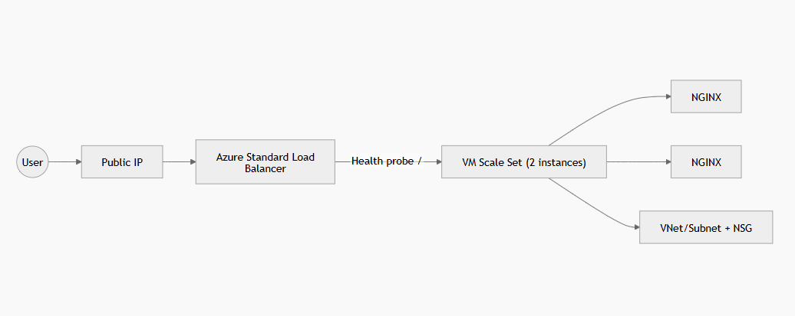

# Azure Auto-Healing Web Tier (Terraform)

Goal: Stand up an auto-healing web tier that can lose any single VM without downtime.

## Why Azure?
Azure VM Scale Sets provide native auto-scaling/rolling upgrades and **Automatic Instance Repairs** integrated with health monitoring (Load Balancer probes or health extensions). This makes “terminate one VM, platform replaces it” straightforward and cloud-native.

## Architecture
- Public IP -> Azure Standard Load Balancer (HTTP/80)
- Load Balancer -> VM Scale Set (2 instances) in a subnet protected by NSG
- VMSS installs NGINX via cloud-init (default welcome page)
- VMSS Automatic Instance Repairs enabled with grace period

## Terraform File Structure



## Prerequisites
- Terraform >= 1.6
- Azure CLI logged in (`az login`)
- An Azure subscription
- SSH public key at `~/.ssh/id_rsa.pub` (or change var)
- In Azure CloudShell make sure you connect to storage account
- Upload the project file (zip) and unzip it (unzip *.zip)

## Run (plan)
```bash
cd infra
terraform init
terraform fmt -recursive
terraform validate
terraform plan
